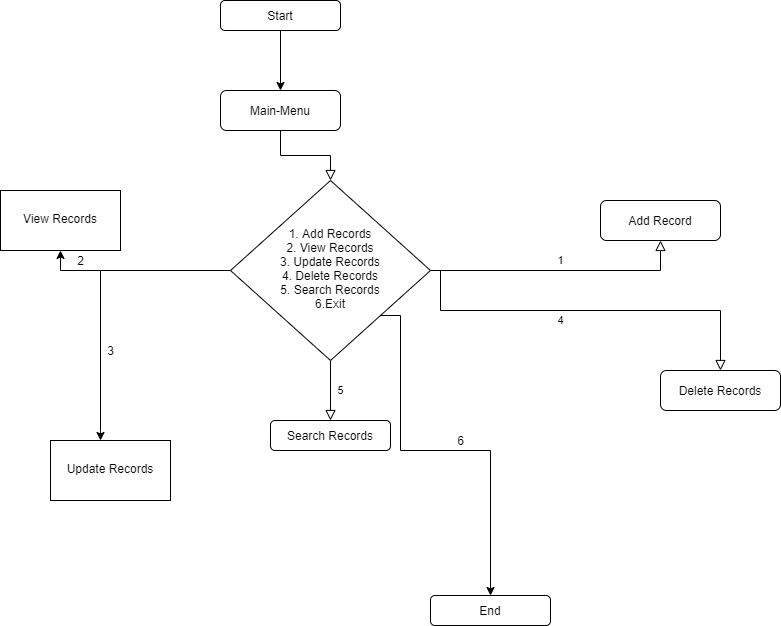

# Shop-Management-System---BST-Implementation
Shop Management System - The Binary Search Tree Implementation

# Shop Management System

## Introduction

### 1.1 Synopsis Project
In today’s era, almost every shop wants to broaden its services and reach a maximum number of people in order to increase sales and ultimately profit. The shop can be of garments, Café point, etc. The best example is that of the Shopping Malls where the customer is assisted with this functionality of taking data of an item, generating the bill, and entertaining the queries of customers in no time using Point of Sale (POS). The project will provide the main CRUD operations and search functionality to the admin. CRUD includes Create, Read, Update, and Delete records.

### 1.2 Objective of the Project
1. **C# language** will be used.
2. **CLI based application** that will allow the admin to create, read, update, and delete the records.
3. **Binary Search Tree** will be implemented to achieve the above-mentioned functionalities.
4. The given table in the requirement document will be populated by results that come from the comparison.

## System Analysis and Design

### 2.1 System Requirements
**Use Case Diagram** – Describes the user of the system and detailed descriptions of each use case.

#### Use Case Description for Shop Management System

The system user is a POS admin where the admin will issue and save data of items sold.

| Actor | Task |
|-------|------|
| Admin | • Insert, delete, update, read the records • Search record by id • Exit |

#### Detail Description for Each Use Case

The system has the following main use cases:

| Use Case   | Purpose                                                                 |
|------------|-------------------------------------------------------------------------|
| CRUD       | The admin can Create/Add, read/view, update, delete the item records in the database. |
| Search Record | Admin can search Item record by Id                                      |

### Flow-Chart

## Conclusion
The C# based object-oriented application will be designed to provide a user-friendly CLI based interface to navigate through the various functionalities like add, read, update, and delete. Binary Search Tree (BST) will be used as we have the best average complexities for the CRUD operations of the BST. For implementing these data structures, C# programming language will be used for the BST.

The End
